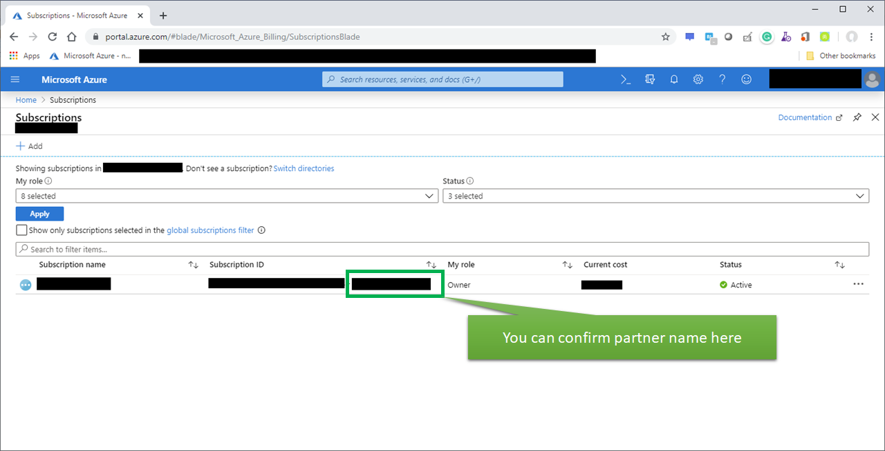

My Azure Partner Help Extension
============================

This extension works to enhance user experience of [Microsoft Azure Portal](https://portal.azure.com/).

## How to install

Visit https://chrome.google.com/webstore/detail/hnndmmbjpcjdlpmdidocdgmecphmnbkp/ with Chrome browser and add this extension.

# Offering features

No.1: add partner names on your subscritpion ID list like below

## Reference for development

- https://github.com/normalian/My-Azure-Portal-ChromeExtension

## Copyright
<table>
  <tr>
    <td>Copyright</td><td>Copyright (c) 2019- Daichi Isami</td>
  </tr>
  <tr>
    <td>License</td><td>MIT License</td>
  </tr>
</table>